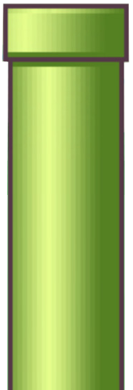

# Flappy Bird

C# Windows Forms ile geliştirilmiş klasik Flappy Bird oyunu.

[](https://dotnet.microsoft.com/)
[](https://docs.microsoft.com/dotnet/csharp/)

## Oyun Hakkında

Kuşu kontrol ederek borulardan geçmeye çalıştığınız klasik Flappy Bird deneyimi. Skor arttıkça oyun hızlanır ve zorluk seviyesi yükselir.

## Önizleme

| Kuş | Boru | Zemin |
|:---:|:----:|:-----:|
|  |  |  |

## Özellikler

- Basit ve akıcı oynanış
- Skor takibi
- Skora bağlı zorluk artışı (hız 8 → 11 → 15 → 20)
- DevExpress bileşenleri ile modern arayüz

## Teknolojiler

- **C#** (.NET Framework 4.6.1)
- **Windows Forms**
- **DevExpress v18.1**

## Gereksinimler

- Windows işletim sistemi
- Visual Studio 2017 veya üzeri
- .NET Framework 4.6.1 veya üzeri
- [DevExpress v18.1](https://www.devexpress.com/) bileşenleri (ücretli lisans gerektirir)

> **Not:** DevExpress ticari bir kütüphanedir. Projeyi derlemek için makinenizde DevExpress v18.1 kurulu olmalıdır. GitHub Actions üzerinde otomatik derleme bu nedenle yapılandırılmamıştır.

## Kurulum

```bash
git clone https://github.com/mbesirkesen/flappybird.git
cd flappybird
```

1. Visual Studio'da `flappybird.sln` dosyasını açın
2. DevExpress bileşenlerinin yüklü olduğundan emin olun
3. **Build → Build Solution** ile derleyin
4. **Debug → Start Debugging** (F5) ile çalıştırın

## Oynanış

- **Boşluk tuşu** — Kuşu yukarı hareket ettirir (basılı tutulduğunda süzülür)
- Borulardan geçerek skorunuzu artırın
- Borulara, zemine veya ekran üst sınırına çarpmayın

## Proje Yapısı

```
flappybird/
├── Form1.cs              # Ana oyun mantığı (flippybird formu)
├── Form1.Designer.cs     # Form tasarımı
├── Program.cs            # Uygulama giriş noktası
├── Resources/            # Oyun görselleri (kuş, boru, zemin)
├── Properties/           # Proje kaynakları ve ayarları
├── docs/                 # Dokümantasyon
│   └── oyun-akis-semasi.jpeg
├── flappybird.sln
└── flappybird.csproj
```

Oyun akış şeması: [docs/oyun-akis-semasi.jpeg](docs/oyun-akis-semasi.jpeg)

## Katkıda Bulunma

1. Bu repoyu fork edin
2. Yeni bir branch oluşturun (`git checkout -b ozellik/yeni-ozellik`)
3. Değişikliklerinizi commit edin
4. Branch'inizi push edin ve Pull Request açın

## Geliştirici

**Muhammed Beşir Kesen**
